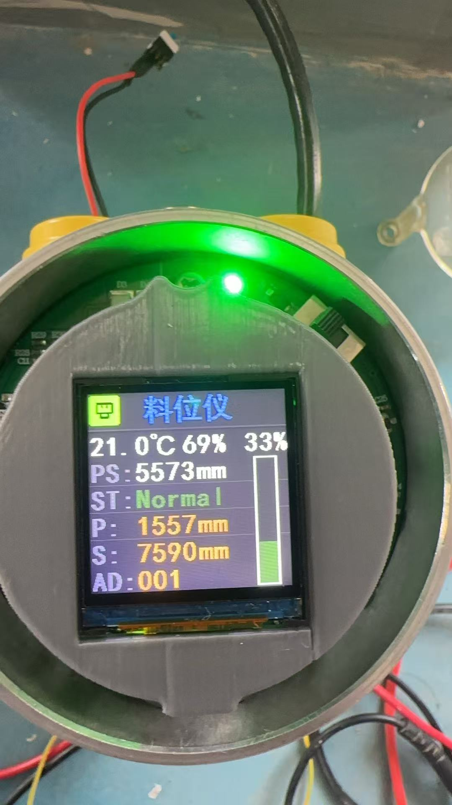

# 基于 STC8H 的激光料位仪

- 项目开发时间：2025 年 12 月—2026 年 1 月。
- 源码公开整理：2026 年 9 月。此次发布为此前项目的源码归档与文档补充。

面向料位监测场景的嵌入式固件：集成激光测距、温湿度采集、LCD 显示、按键操作与 Modbus RTU 通信。

## 当前版本与实物

来源：作者提供的 `DRIVER(2).zip`。保留其中 90 个源码及 Keil 工程文件的原始字节；未加入旧版特有文件。排除历史编译产物、个人 IDE 设置、备份和内部审查文档。本次只更新公开资料，未修复业务代码。

照片展示装配与界面，不作为测量精度验证。

## 技术组成

- 主控：Keil 工程配置为 STC8H4K64TL Series，系统时钟配置为 24 MHz。
- 测距：UART4 对接激光模块；主程序注释标识为 MT9700，实物型号需按硬件确认。
- 显示：ST7789 LCD 驱动、界面刷新及背光超时管理。
- 传感器：DHT11 温湿度采集。
- 通信：UART3 Modbus RTU 从站；NE2 模块承担网络侧转换，网络参数需在模块侧配置。
- 模拟量输出：GP8202AS，通过硬件 I²C 提供 4–20 mA 输出路径。
- 参数保存：EEPROM 保存设置与设备地址。
- 调度：1 ms 系统节拍、主循环轮询、串口中断缓冲和异步命令队列。

## 目录与阅读顺序

| 文件 | 作用 |
| --- | --- |
| `USER/main.c` | 初始化顺序和主循环入口 |
| `DRIVER/app.c` | 自动测量、传感器采集、显示和按键任务 |
| `DRIVER/cmd_queue.c` | 测距命令排队、响应处理和超时管理 |
| `DRIVER/gp8202.c` | I²C DAC 与电流输出 |
| `DRIVER/uart.c` | 串口中断及收发缓冲 |
| `DRIVER/modbus.c` | RTU 帧处理、CRC16 和寄存器映射 |
| `DRIVER/st7789.c`、`DRIVER/ui.c` | 显示驱动和界面 |
| `RVDMK/LASER_STC.uvproj` | Keil C51 工程 |

## 复现步骤

1. 准备 Keil µVision/C51 和对应 STC 芯片支持，打开 `RVDMK/LASER_STC.uvproj`。
2. 核对目标芯片、24 MHz 时钟配置及 `DRIVER`、`USER` 头文件路径。
3. 按各驱动中的引脚定义核对硬件连接；本次附实物照片，但尚未包含原理图、PCB 和详细接线图。
4. 编译后使用适配目标芯片的下载工具烧录，分别检查测距响应、按键、显示及 Modbus 读写。
5. UART3/UART4 初始化配置为 9600 bps；RTU 从站地址在 `main.c` 中默认为 1。NE2 的网络参数与工作模式需单独核对。

当前发布是原始源码存档，未在本次整理中执行 C51 编译、烧录或硬件验证。源码文件保留原始字节与编码；旧中文文档如显示乱码，请尝试 GBK 编码。

## 寄存器概要

以下数字是源码直接使用的十进制协议地址，不能直接套用上位机软件的 3xxxx/4xxxx 显示编号；使用时应确认软件的基址规则。

| 地址 | 含义 |
| --- | --- |
| 3000 | 从站地址 |
| 3001–3002 | 温度、湿度，采用高低字节组合格式，详见 `app.c` |
| 3003 | 有效量程 |
| 3004 | 测量结果数据，详见 `cmd_queue.c` 的解析与换算 |
| 3005 | 料位百分比 |
| 3006 | 错误标志 |
| 4000 | 屏幕超时，默认 60 秒；255 表示常亮 |
| 4001–4002 | 自动测量间隔和倒计时，高字节为分、低字节为秒 |
| 4003–4004 | 起点和终点参数，默认 5000 / 1000 mm |

## 已知问题与验证边界

- 已修复旧版第 21 字节额外丢失问题。
- `cmd_queue.c` 与 `app.c` 百分比公式不一致：起点 5000、终点 1000、距离 3000 时分别产生 25% 与 50%。两者写入同一寄存器，且电流输出依赖该寄存器。
- `ParseDecimal()` 缺少 16 位溢出检查，70000 会回绕为 4464。
- 残帧清理仅覆盖少于 8 字节的数据，更长的不完整 0x10 报文仍可能污染下一次请求。
- `STC8G_H_I2C.c` 的 `Wait()` 没有超时，完成位不出现时会阻塞主循环；需增加故障退出与恢复。
- 主循环使用轮询调度与队列，但 DHT11 时序和显示操作仍可能占用执行时间，不应据此宣称整个系统完全无阻塞。
- 料位换算与百分比的边界行为需结合安装位置、起止点定义和实测数据确认；未发布测量精度、量程或稳定性指标。
- 当前资料不构成完整硬件复现包，未包含原理图、PCB、标定记录与实测报告。

## 第三方代码与授权说明

本目录包含 STC 厂商驱动、启动文件等第三方内容，原有版权和来源说明予以保留；这些内容不作为个人原创贡献。

源码公开供项目展示和阅读。未新增统一的 MIT 等开源许可证，第三方文件遵循其原有声明；网站根目录的主题许可证不用于覆盖本目录的第三方授权条件。转载、修改或再分发前，请核对对应文件的授权。
